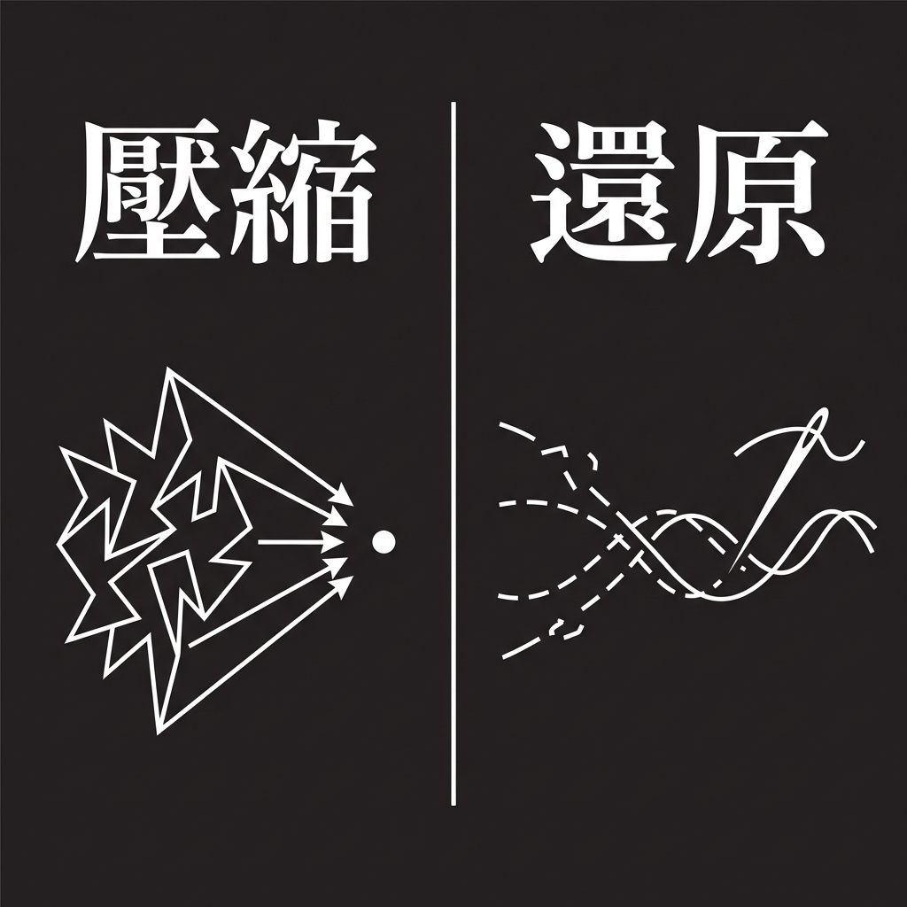
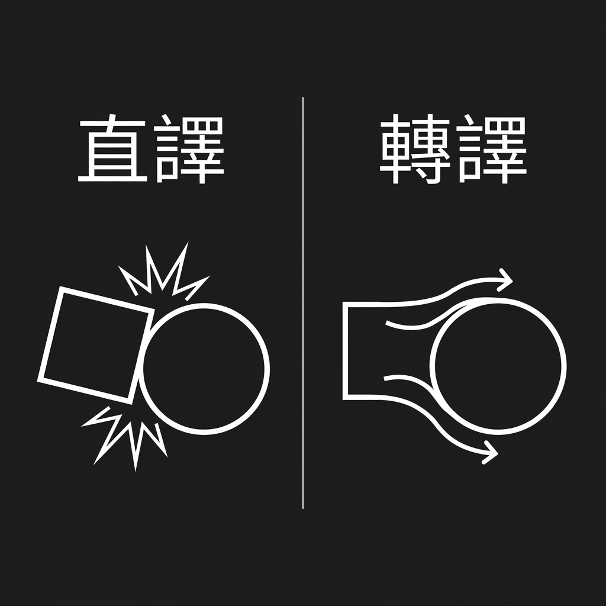
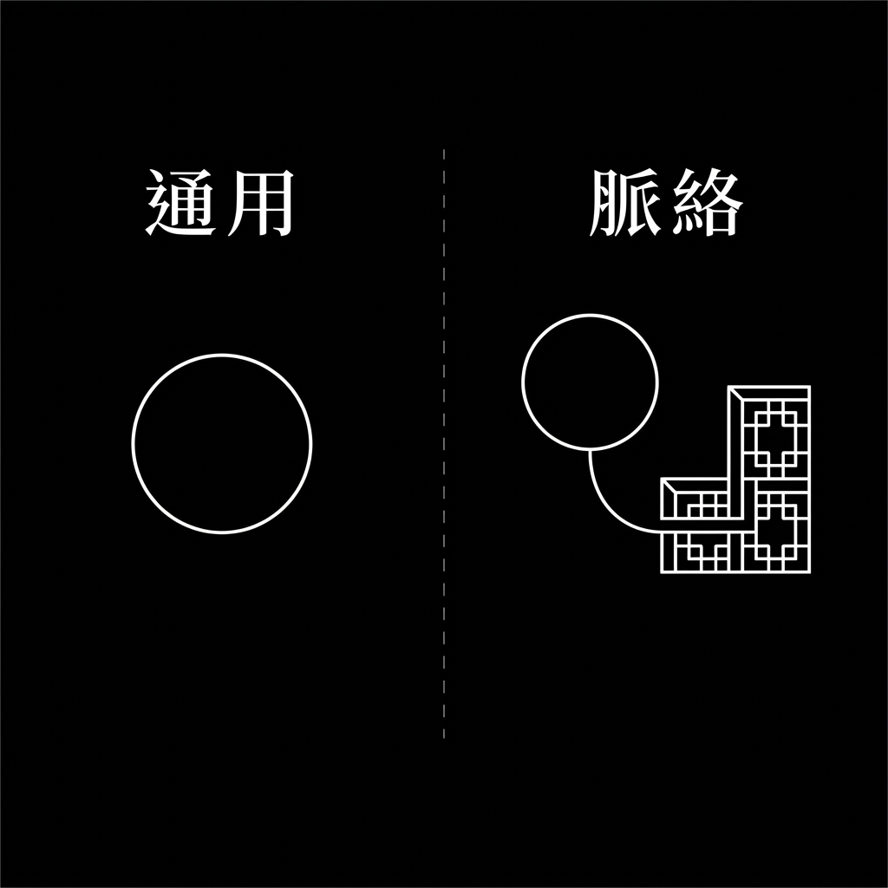
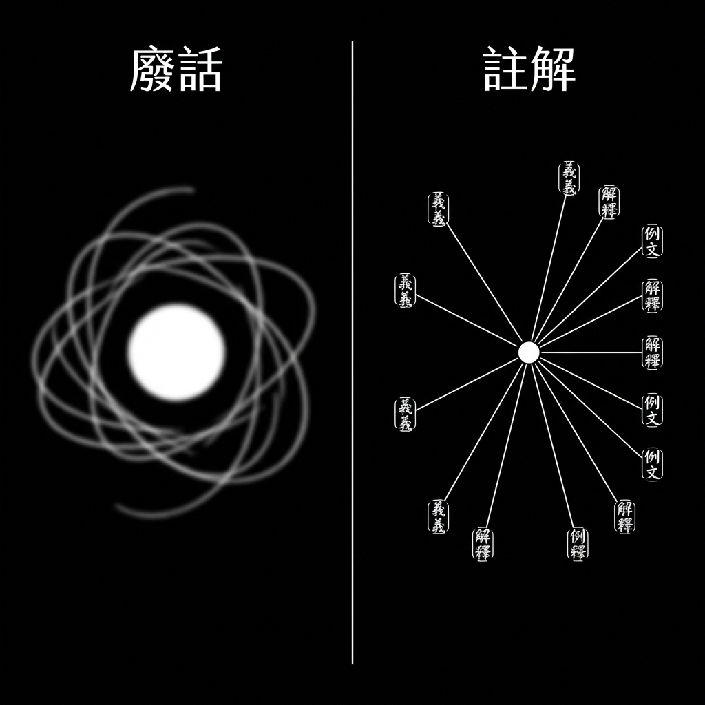
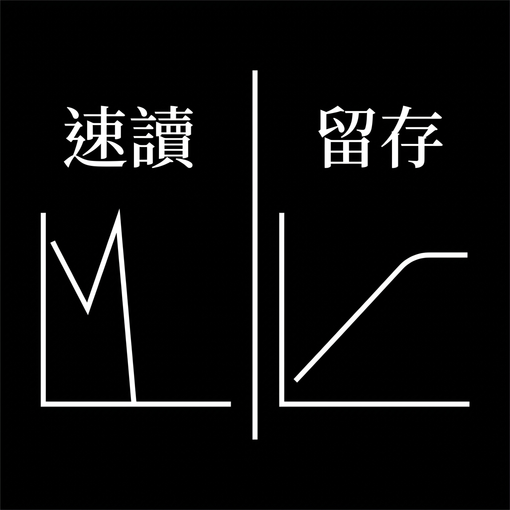
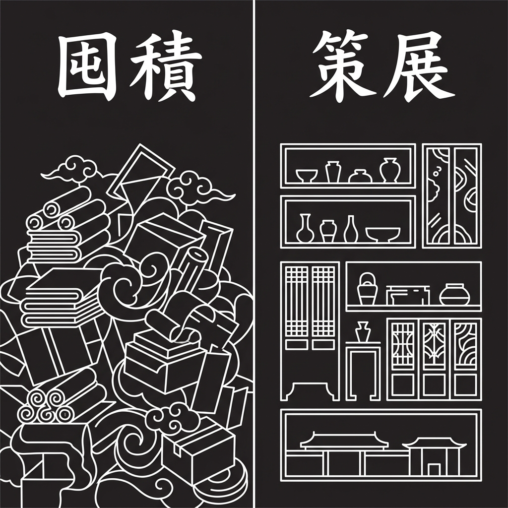
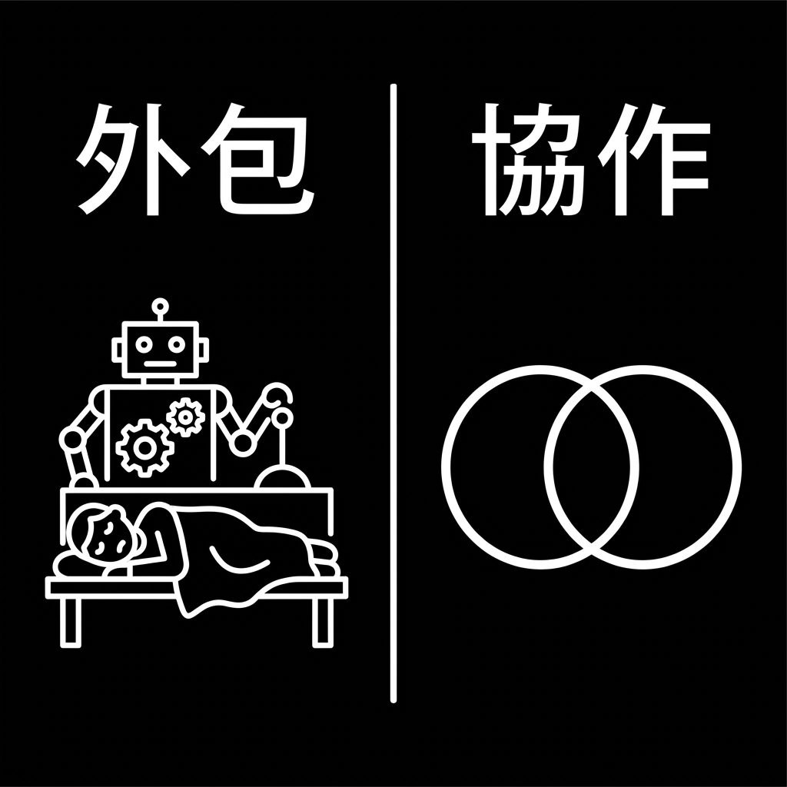
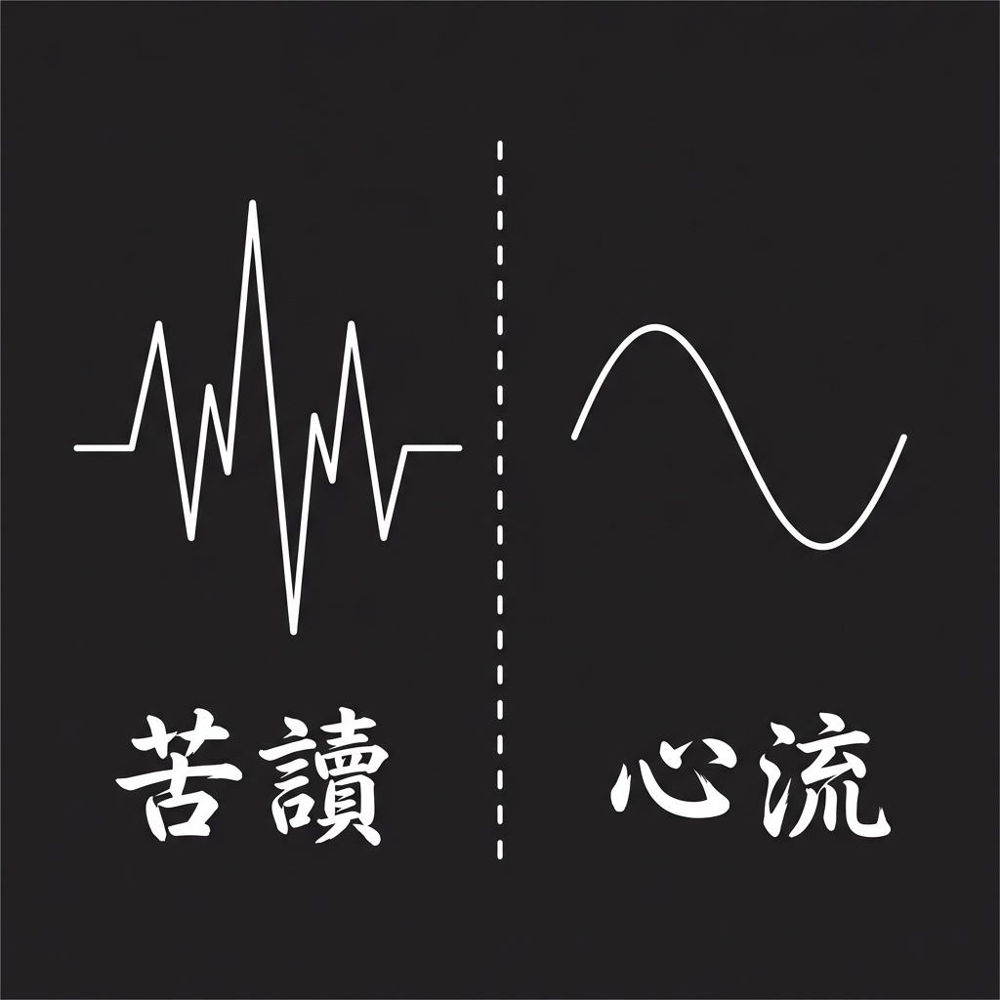
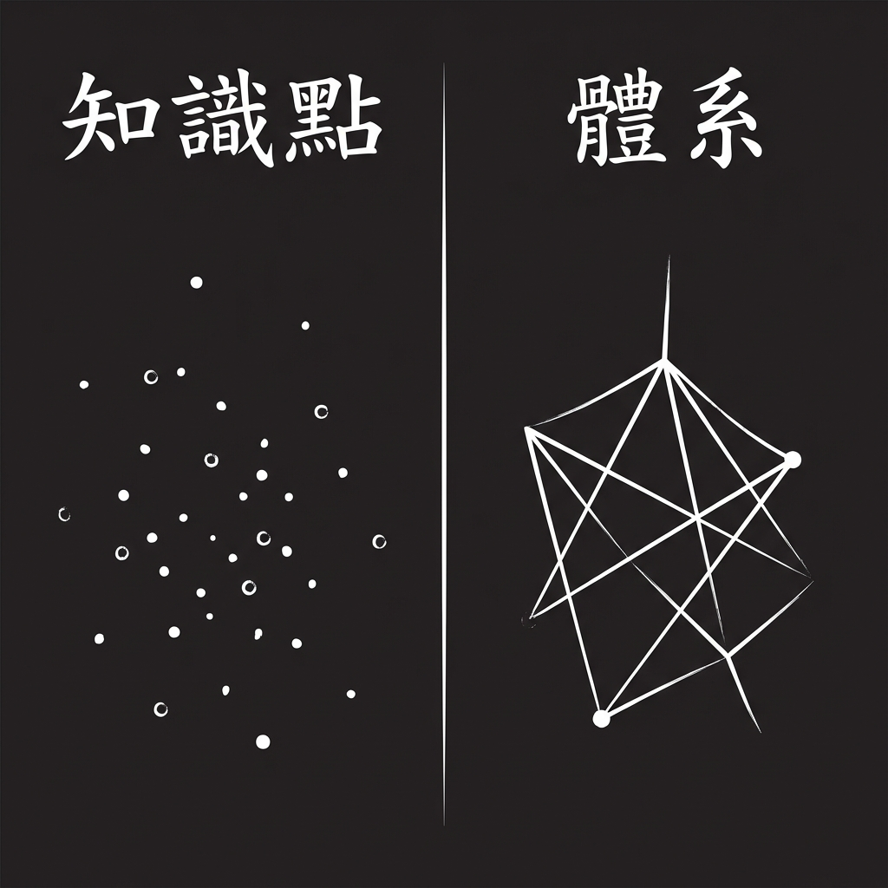
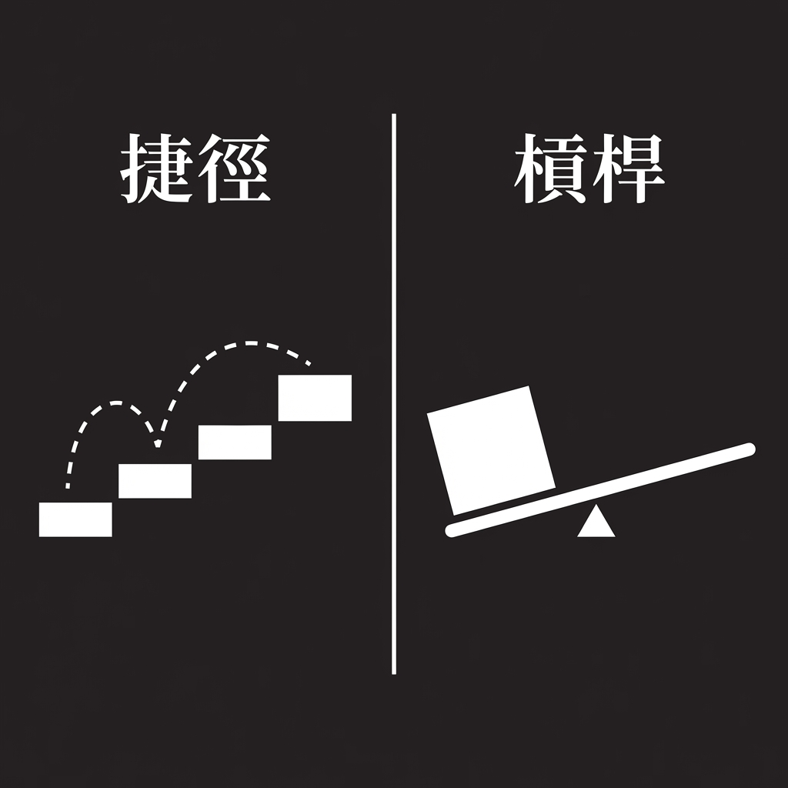

# THE PHYSICS OF INSIGHT (Traditional Chinese Version)
### A Deep Learning Manifesto in 11 Visuals - Localized
**Style Influence:** Jack Butcher / Visualize Value (Localized for Taiwan)

---

This version explores the visual translation of the concepts into Traditional Chinese characters.
*Note: AI generated text may have imperfections. The concepts remain the focus.*

---

### 01. Compression vs. Restoration (壓縮 vs. 還原)
**Concept:** 壓縮是把牛排打成肉泥；還原是把碎布縫成錦繡。

---

### 02. Translation vs. Localization (直譯 vs. 轉譯)
**Concept:** 直譯是方鑿圓枘；轉譯是行雲流水。

---

### 03. Generic vs. Contextual (通用 vs. 脈絡)
**Concept:** 通用是孤島；脈絡是掛鉤。

---

### 04. Fluff vs. Annotation (廢話 vs. 註解)
**Concept:** 廢話是虛胖的脂肪；註解是精密的手術。

---

### 05. Speed vs. Retention (速讀 vs. 留存)
**Concept:** 速讀是曇花一現；留存是高原平台。

---

### 06. Hoarding vs. Curation (囤積 vs. 策展)
**Concept:** 囤積是垃圾場；策展是博物館。

---

### 07. Outsourcing vs. Partnership (外包 vs. 協作)
**Concept:** 外包是人睡覺機器做；協作是人機共舞。

---

### 08. Grind vs. Flow (苦讀 vs. 心流)
**Concept:** 苦讀是摩擦力；心流是超導體。

---

### 09. Knowledge vs. System (知識點 vs. 體系)
**Concept:** 知識點是散落的珍珠；體系是項鍊。

---

### 10. Shortcut vs. Leverage (捷徑 vs. 槓桿)
**Concept:** 捷徑是偷懶；槓桿是智慧。

---

### 11. The Bridge (橋樑)
*(Note: Generation for the final image hit a pause. Please imagine a bridge connecting '來源' and '理解'.)*
*(Image pending)*

---
**Generated by Antigravity Agent** | *2026-01-11*
